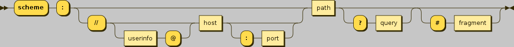

[](https://godoc.org/github.com/jbsmith7741/uri)
[](https://travis-ci.com/jbsmith7741/uri)
[](https://goreportcard.com/report/github.com/jbsmith7741/uri)
[](https://codecov.io/gh/jbsmith7741/uri)

Support for go 1.12+ 

Older versions will probably work, but are not officially supported or tested against. 

Known Issues: 
 - maps will not work before 1.12 because of use of reflect.RangeMap

# uri

A convenient and easy way to convert from a uri to a struct or vic-versa. [wikipedia](https://en.wikipedia.org/wiki/Uniform_Resource_Identifier)



## special keywords

- origin (scheme:host/path) 
- scheme
- authority (userinfo@host)
  - userinfo
    - username
    - password 
  - host (includes port)
  - port 
- fragment 

## struct tags

- **uri** - the name of the variable or to designate a special keywords (schema, host, etc). empty defaults the exact name of the struct (same as json tags)
- **default** - defined the default value of a variable
- **required** - if the param is missing, unmarshal will return an error
- **format** - 
  - time.Time: time format field for marshaling of time.Time `format:"2006-01-02T15:04:05Z"`
  - rune/int32: `format:"rune"`

## Other Options

### Use "json" struct tag values
You may use existing "json" struct tag values instead of defining "uri" values for query parameter names.
The uri tag can be used to override the values in the json struct tag. 

## Non-Standard Query Params Support 

### Arrays/Slices 
Arrays are supported by passing a comma separated list or by passing the value multiple times

  - `?array=1,2,3,4,5,6`
  - `?array=1&array=2&array=3&array=4`

### Maps
Maps are supported by providing the key value param into the value with a colon `:` in between them. Multiple pairs 
can be passed as separated params or joined with the pipe `|` 

  - map[string]int `?map=a:1|b:2|c:3` 
  - map[int]string `?map=1:a&map=2:b&map=3:c`
  - map[string][]int `?map=a:1,2,3|b:4,5,6`
  - map[int]time.Time 'format:"2006-01-02' `?map=0:2020-01-01`

## example 1

If we have the uri "http://example.com/path/to/page?name=ferret&color=purple" we can unmarshal this to a predefined 
struct as follows:

``` go
type Example struct {
    Scheme string `uri:"scheme"`
    Host   string `uri:"Host"`
    Path   string `uri:"path"`
    Name   string `uri:"name"`
    Color  string `uri:"color"`
}

func() {
e := Example{}

err := uri.Unmarshal("http://example.com/path/to/page?name=ferret&color=purple", &e)
}
```

This would become the following struct:

``` go
e := Example{
    Schema: "http",
    Host:   "example.com",
    Path:   "path/to/page",
    Name:   "ferret",
    Color:  "purple",
    }
```

## example 2 - defaults

``` go
var site = "http://example.org/wiki/Main_Page?Option1=10"

type MyStruct struct {
    Path    string `uri:"path"`
    Option1 int
    Text    string `default:"qwerty"`
}

func Parse() {
    s := &MyStruct{}
    uri.Unmarshal(site, s)
}
```

this becomes

``` go
e := &MyStruct{
    Path: "/wiki/Main_Page"
    Option1: 10,
    Text: "qwerty",
}
```

## example 3 - required field

``` go
type Example struct {
    Name string `uri:"name"`
    Token string `uri:"token" required:"true"`
}
func Parse() {
   site := "?name=hello"
   e := &Example{}
   err := uri.Unmarshal(site, e)
}
```
Result
```
    token is required
```